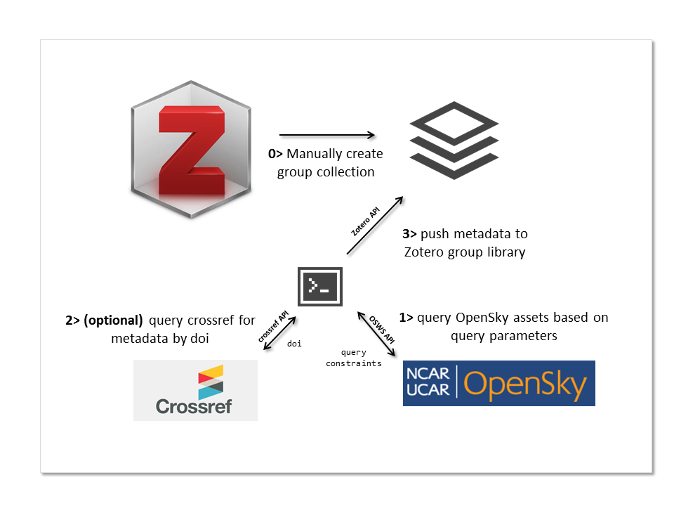

# OpenSky Web Services + Zotero Integration Experiment
The goal of this experiment is to see how to use the [Zotero API](https://www.zotero.org/support/dev/web_api/v3/start) in the context of the NCAR Library's [OpenSky API](https://docs.google.com/document/d/1gRNhtWkCYFd4Ho9R4X_1J0z_YUEIBhw33e_oRlZ4YYE).

## Use Cases

| Use case | Description |
|----------|-------------|
|Users can import open sky publications into Zotero for tagging and group bibliographic management. | Users are often in need of collaborating on creating, maintaining and sharing bibliographies and/or confirming authorship, _especially in cases where labs are trying to produce annual summaries of publication activities_.  This demonstration shows a way for groups to be created, managed and updated outside OpenSky (using Zotero) with integration points and data from OpenSky. |

## Implementation

The goal of the implementation is to demonstrate end-to-end capabilities to:

1. execute a query to the [OpenSky web service](https://docs.google.com/document/d/1gRNhtWkCYFd4Ho9R4X_1J0z_YUEIBhw33e_oRlZ4YYE) (OSWS),
2. extract the metadata from the OSWS and put a subset of the metadata into a group library managed in Zotero.

The implementation will rely on the webservices provide by Zotero and to run this on your own, you will

*an API key generated for the Zotero group library you want to push data to (see [Zotero API documentation](https://www.zotero.org/support/dev/web_api/v3/start) for this),
* OpenSky web services are available to make a query

The [demonstration implementation notebook](./implementation_note.ipynb) shows this in action.  It can also be as  Jupyter Notebook [here](http://nbviewer.jupyter.org/github/NCAR/NCAR_library_experimental/blob/zotero_integration/opensky_zotero_integration/implementation_note.ipynb).

## Requirements

* Python 2.7.x+
* [requests](http://docs.python-requests.org/en/master/), [json](https://docs.python.org/2/library/json.html) libraries
* [Zotero](https://zotero.org) account
* access to [OSWS](http://cypressvm.dls.ucar.edu:8788/osws/explorer/osws)

